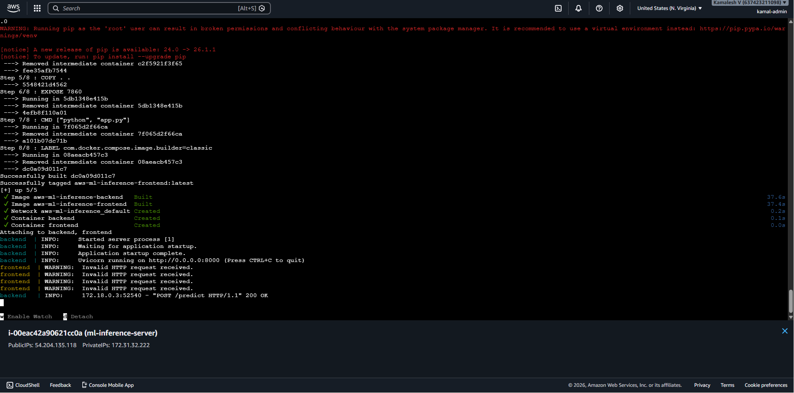

# AWS ML Inference System

## Overview

This project deploys a containerized machine learning inference system on AWS using a multi-container architecture.

The backend API loads trained model artifacts from Amazon S3 and serves predictions through FastAPI, while a Gradio frontend provides a public user interface.

The system is orchestrated using Docker Compose and deployed on an Amazon EC2 instance.

---

## Architecture

```text
User Browser
      ↓
Gradio Frontend (Port 7860)
      ↓
FastAPI Backend (Port 8000)
      ↓
Model Artifact from Amazon S3
```

---

## Tech Stack

- Python
- FastAPI
- Gradio
- Docker
- Docker Compose
- AWS EC2
- AWS S3
- IAM Roles
- Linux

---

## Features

- Multi-container deployment using Docker Compose
- FastAPI inference backend
- Gradio web interface
- Dynamic model loading from Amazon S3
- EC2 cloud deployment
- Internal Docker networking between services
- Public inference access via security group configuration
- IAM role-based AWS authentication

---

### EC2 Docker Compose Deployment



---

## Deployment Workflow

1. Push project to GitHub
2. Launch AWS EC2 instance
3. Configure Docker and Docker Compose on EC2
4. Clone repository on EC2
5. Start services using Docker Compose
6. Access public Gradio interface via EC2 public IP

---
